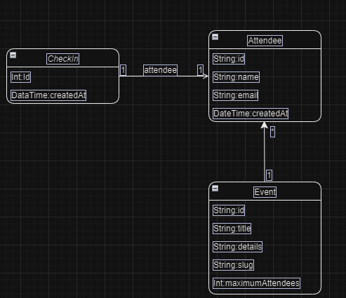

## Projeto feito no nlw da Rocketseat na trilha de JAVA
<h1>Check-in</h1>
<p>O pojeto check-in foi realizado na NLW Unite da rocketeseat, um evento de 4 dias</p>
<p> O pass.in é uma aplicação de gestão de participantes em eventos presenciais.
A ferramenta permite que o organizador cadastre um evento e abra uma página pública de inscrição.
Os participantes inscritos podem emitir uma credencial para check-in no dia do evento.
O sistema fará um scan da credencial do participante para permitir a entrada no evento.
</p>

# Requisitos do projeto:
<ul>
  <li>O organizador deve poder cadastrar um novo evento</li>
  <li>O organizador deve poder visualizar dados de um evento</li>
  <li>O organizador deve poder visualizar a lista de participantes</li>
  <li>O participante deve poder se inscrever em um evento</li>
  <li>O participante deve poder visualizar seu crachá de inscrição</li>
  <li>O participante deve poder realizar check-in no evento</li>
</ul>

# Tecnologias Utilizadas
<ul>
  <li>Java</li>
  <li>Spring boot</li>
</ul>

# Bibliotecas Utilizadas:
<ul>
  <li>Spring web</li>
  <li>Flyway</li>
  <li>Dev Tools</li>
  <li>JPA</li>
</ul>

 # Banco de dados Utilizado:
 <ul>
  <li>hsqldb</li>
</ul>

Configuração do banco de dados: 
```
		<dependency>
			<groupId>org.hsqldb</groupId>
			<artifactId>hsqldb</artifactId>
			<version>2.7.1</version>
		</dependency>
```
## Esquema de tabelas usado no projeto:


## Instalação do prrojeto:
Clone o repositório: 'https://github.com/Pedrohss2/pass-in-nlw' para sua máquina local.
Instale as depêndencias e inicie o projeto dentro da classe:
```
@SpringBootApplication
public class PassInApplication {
	public static void main(String[] args) {
		SpringApplication.run(PassInApplication.class, args);
	}
}
```
